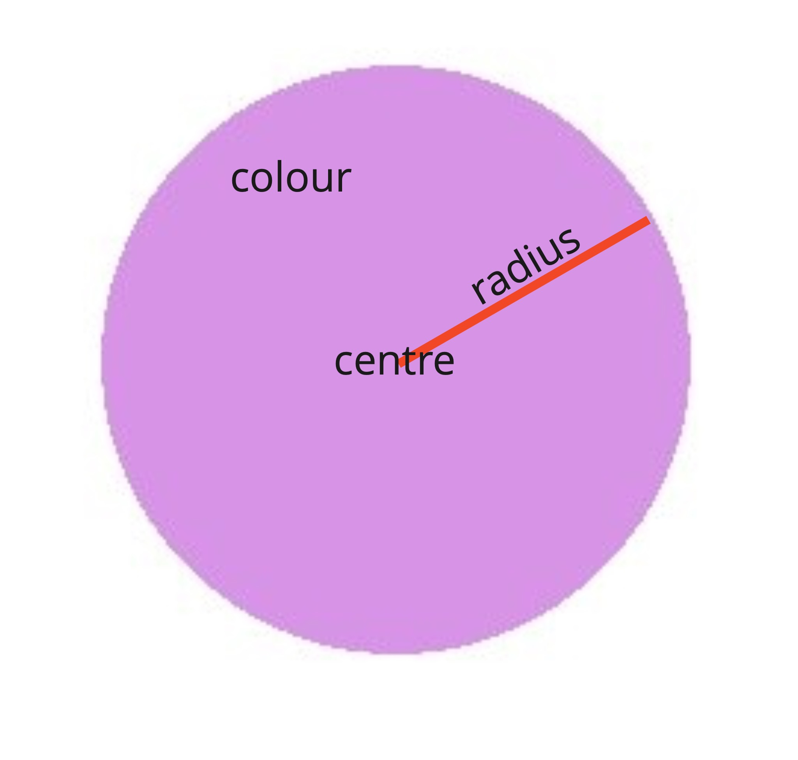
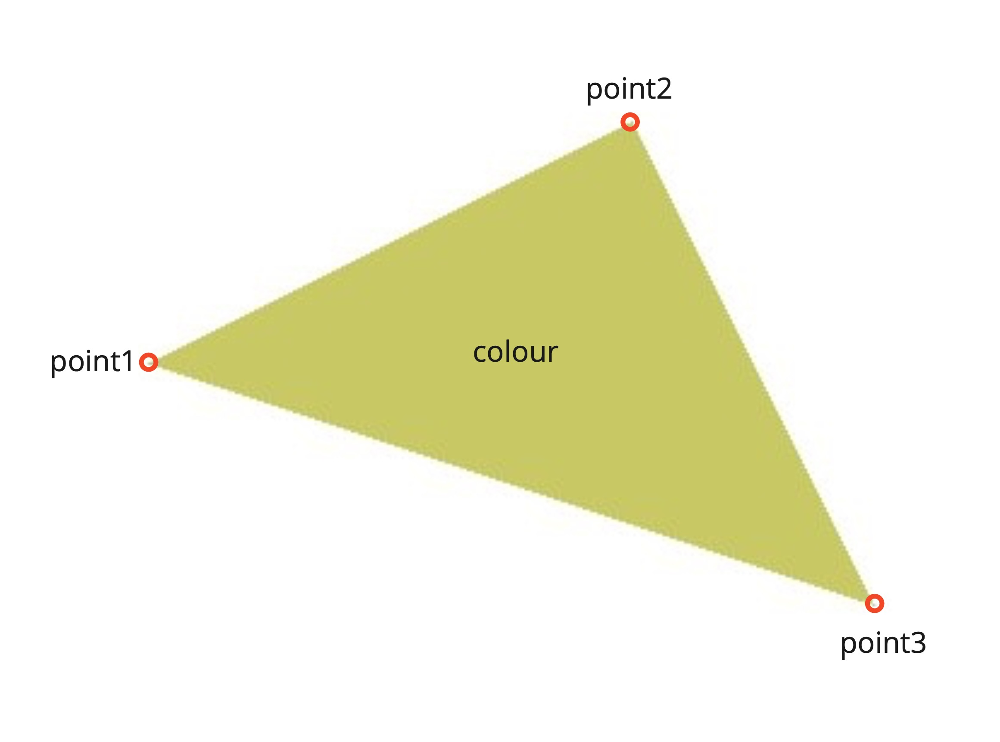
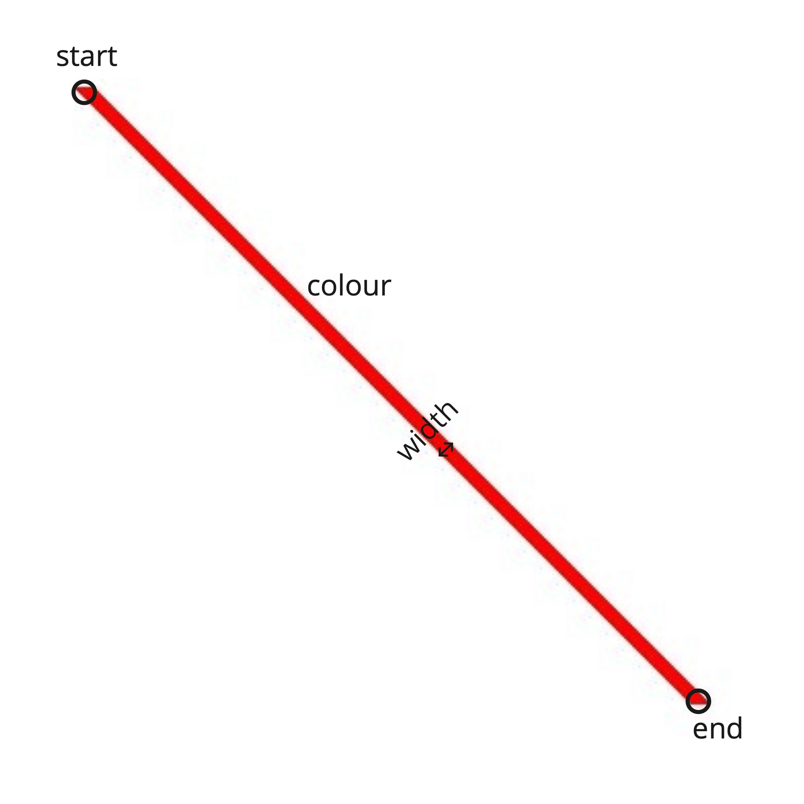

# Python Sketch


### Window Setup

```python
from Sketch import Window # imports code from the sketch module
win = Window(500, 500) # creates a 500x500 pixel window called 'win'
# TODO: add your code here
win.display() # displays the window
```


---

### Screenshots

To save one of your images, run the code and with the window open, press the ENTER/RETURN key on your keyboard.
Once you close the window, your screen capture will be saved.


---

### Colours

A colour can be represented by RGB (red green blue) values.
0 is the minimum and 255 is the maximum. So

```python
red = [255, 0, 0]
```

means maximum red with minimum blue and green.
To easily find out the RGB values for a particular colour, use Google's [color picker](https://g.co/kgs/6nrJno).


---

### Coordinates

The screen is made up of a rectangular grid of pixels.
Each pixel is an individual colour.

The top left pixel is at coordinate (0,0).
The x-axis goes horizontally from left to right.
The y-axis goes vertically from top to bottom.


---

### Rectangles

```python
win.rectangle(<colour>, <topleft>, <width>, <height>)
```
* `<colour>` must be an RGB array, like `[255, 0, 0]`
* `<topleft>` must be an (x,y) coordinate array, like `[50, 100]`
* `<width>` must be an integer between 0 and the width of the window, like `200`
* `<height>` must be an integer between 0 and the height of the window, like `55`

Example:
```python
win.rectangle([255, 0, 0], [50, 100], 200, 55)
```


---

### Circles

```python
win.circle(<colour>, <centre>, <radius>)
```
* `<colour>` must be an RGB array, like `[0, 255, 0]`
* `<centre>` must be an (x,y) coordinate array, like `[300, 350]`
* `<radius>` must be an integer greater or equal to 1, like `45`

Example:
```python
win.circle([0, 255, 0], [300, 350], 45)
```




---

### Triangles

```python
win.triangle(<colour>, <point1>, <point2>, <point3>)
```
* `<colour>` must be an RGB array, like `[0, 0, 255]`
* `<pointN>` must be an (x,y) coordinate array, like `[300, 100]`

Example:
```python
win.triangle([0, 0, 255], [300, 100], [300, 200], [350, 150])
```




---

### Lines

```python
win.line(<colour>, <start>, <end>, <width>)
```
* `<colour>` must be an RGB array, like `[0, 0, 0]`
* `<start>` must be an (x,y) coordinate array, like `[75, 175]`
* `<end>` must be an (x,y) coordinate array, like `[125, 300]`
* `<width>` must be an integer greater or equal to 1, like `5`

Example:
```python
win.line([0, 0, 0], [75, 175], [125, 300], 5)
```


