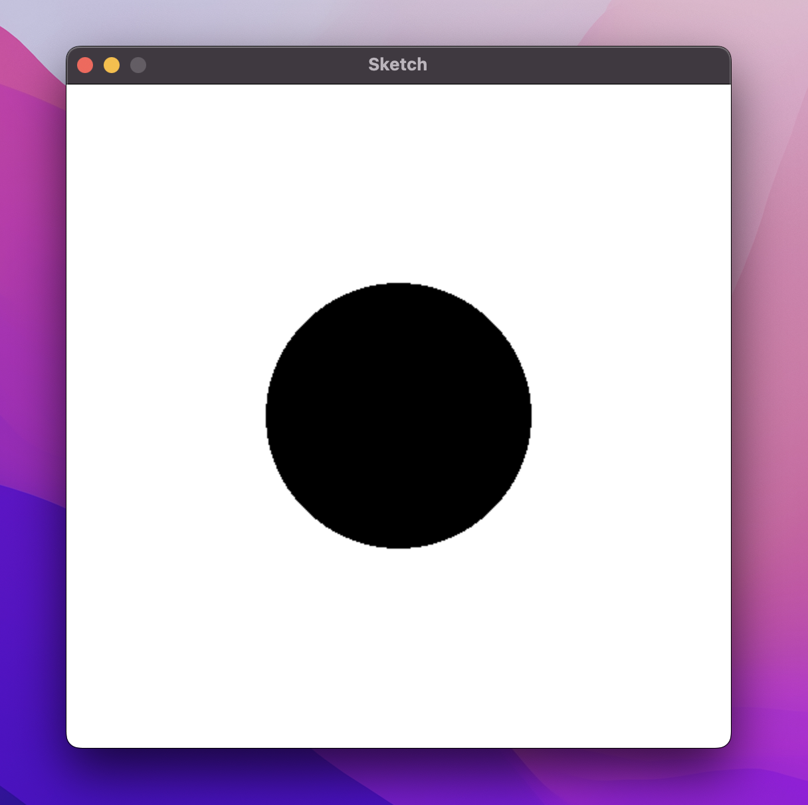

# Lesson 1

---

## Setup

1. Install the latest version of Python. See instructions [here](https://www.python.org/downloads/).
2. Install Pygame. See instructions [here](https://www.pygame.org/wiki/GettingStarted).
3. Download the ZIP file containing this lesson and the corresponding code. Find the repository [here](https://github.com/ripytide/ks3-project).


---

## This Worksheet

This worksheet will take you through examples of how to draw shapes on a screen to create interesting images.

Follow along, copy and run any code that you see. If the example code starts with `>>>` signs, you should write it in your shell/console window.

Otherwise, write it in a .py Python file.


---

## Create a New File

Within this directory you should see two files:


The first thing to do is create a new Python (.py) file in this folder.
You can name it whatever you like. This will be the file you write your code in.


---

## Sketch

After creating your new Python file, you can import the window from the Sketch module.

```python
from sketch import Window
```

This gives you access to commands that will draw shapes on the screen.

The next step is to create a new window:

```python
win = Window(500, 500)
```

This creates a window that is 500 pixels wide and 500 pixels tall.
It stores it in a variable called `win` so we can refer to it later.

Finally, use the following code to display the window:

```python
win.display()
```

If you run the code, you should see something like this:


To close the window, either press the red circle with your mouse or the ESCAPE key on your keyboard.


---

## Circles

At this point your Python file should look like this:

```python
from sketch import Window
win = Window(500, 500)
# TODO: Write your code here.
win.display()
```

From now on, all the code that you write should go where the comment is, sandwiched between creating the window and displaying it.
This is where we'll create shapes like circles.

The code for drawing a circle takes the following form:

```python
win.circle(<colour>, <centre>, <radius>)
```

* The colour should be a set of three values (red, green, blue).
* The centre should be a set of two values (x, y).
* The radius should be a single value.

So to create a black circle with its centre at coordinate (250, 250) and a radius of 100, we would write:

```python
from sketch import Window
win = Window(500, 500)
win.circle((0, 0, 0), (250, 250), 100)
win.display()
```




---

## Variables and Print

Try out the following in your Python shell/console/interpreter window.

A variable is a container that stores a value and has a label.

```python
>>> area = 51
```

Here I've created a new variable called area and assigned it the value 51.
We can use the `print()` command to output the contents of a variable.

```python
>>> print(area)
51
```

We can reassign a different value to the same variable.
This changes its value.

```python
>>> area = 0
>>> print(area)
0
```


---

## User Input

To interact with the program while it is running, we can use `input()` commands to allow the user to enter text and store it in a variable.

```python
>>> name = input("Enter your name: ")
Enter your name: |
```

This outputs the prompt "Enter your name: " and gives the user the chance to type something here.
Once they press enter, whatever they just typed will get stored in the `name` variable.


---

## Data Types

There are four primitive data types in Python:

* String (a sequence of characters like `"Hello World!"`)
* Integer (a whole number like `255`)
* Float (a decimal number like `3.14159`)
* Boolean (either `True` or `False`)

By default, anything that you input is a string.
To convert one data type to another we must cast it using the following functions:

* `int()` to convert to an integer
* `float()` to convert to a float
* `bool()` to convert to a boolean
* `str()` to convert to a string

For example, to input a string but convert it to an integer we can use:

```python
>>> whole_number = int(input("Enter a whole number: "))
Enter a whole number: 7
>>> print(whole_number)
7
```

Can you try a similar approach with the other data types?


---

## Inputting Radius

Let's modify our program so that it does the following:

1. Ask the user to input a radius and store their response in a variable called `radius` (remember to cast to an integer!).
2. Replace the current radius value of `100` in the `win.circle()` command with this variable.
3. Run the code and the user should be able to enter a value for the radius of the circle!

<details>
    <summary>Answer</summary>

```python
from sketch import Window
win = Window(500, 500)
radius = int(input("Enter radius: "))
win.circle((0, 0, 0), (250, 250), radius)
win.display()
```
</details>


---

## Inputting the Other Values

Awesome! We can now choose the radius ourselves and the program will draw the corresponding circle.

As an extra challenge, can you get the user to input values for the other options too?

i.e. the amounts of red, green and blue in the colour as well as the x and y coordinates of the centre?

```python
>>> Enter radius: 100
>>> Enter x: 150
>>> Enter y: 125
>>> Enter red: 10
>>> Enter green: 200
>>> Enter blue: 153
```


<details>
    <summary>Answer</summary>

```python
from sketch import Window
win = Window(500, 500)
radius = int(input("Enter radius: "))
x = int(input("Enter x: "))
y = int(input("Enter y: "))
red = int(input("Enter red: "))
green = int(input("Enter green: "))
blue = int(input("Enter blue: "))
win.circle((red, green, blue), (x, y), radius)
win.display()
```
</details>